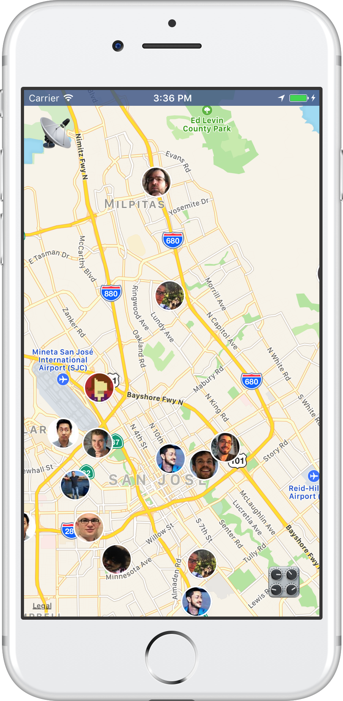
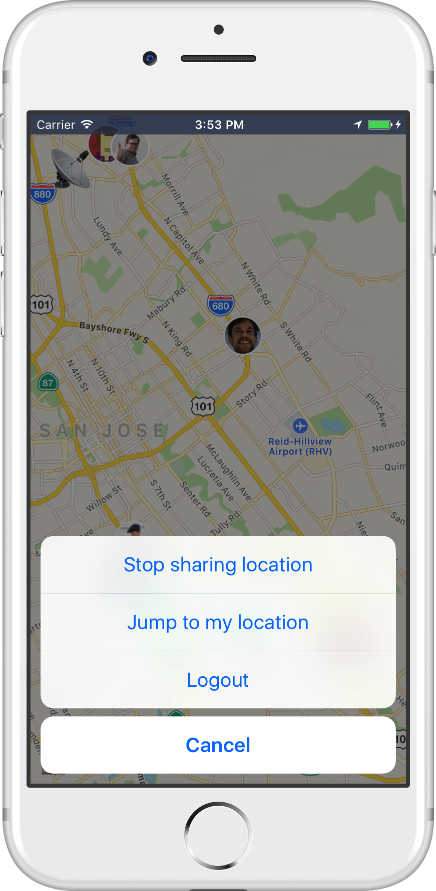

# [wwdc.family](https://wwdc.family)

This is an experiment to use Firebase and React Native to build a [wwdc.family](https://wwdc.family) app. 

Don't use that source code as reference - I have no prior experience with JavaScript, React, nor React Native. 

All feedback welcome of course, feel free to submit a PR too 👍

<table>
  <tr>
    <td>
      
    </td>
    <td>
      
    </td>
  </tr>
</table>

## Setup locally

```
git clone https://github.com/wwdc-family/app
cd app
brew update && brew install node watchman
npm install
react-native run-ios
```

## Logo License

The app icon is released under [Creative Commons CC0](https://creativecommons.org/publicdomain/zero/1.0/deed.en). You are free to adapt and use it for commercial purposes without attributing the original author or source. Although not required, a link back to this project is appreciated.


